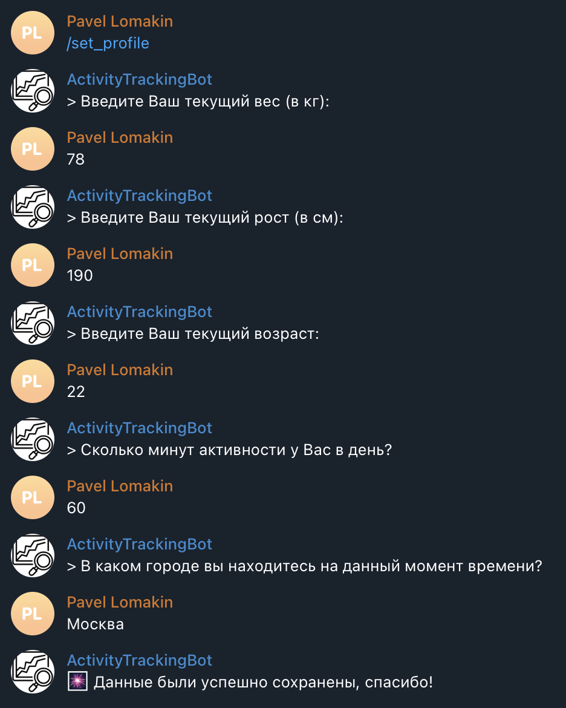
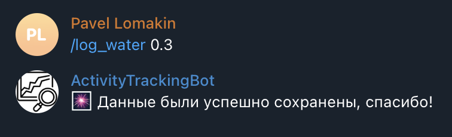
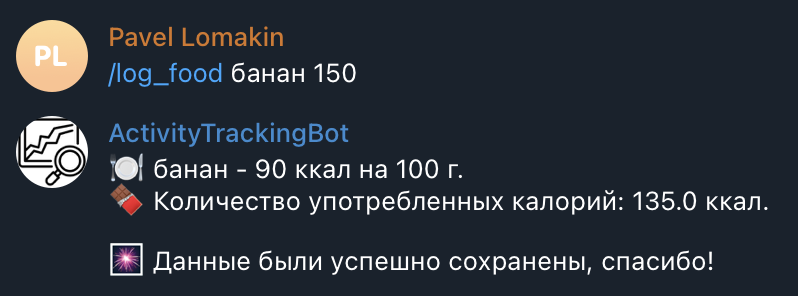
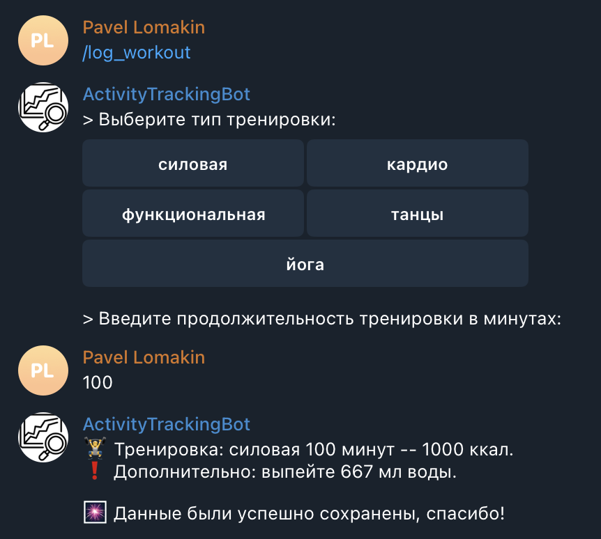
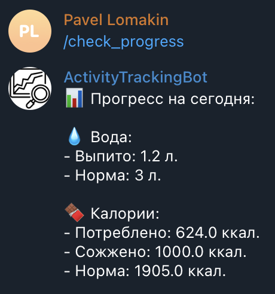
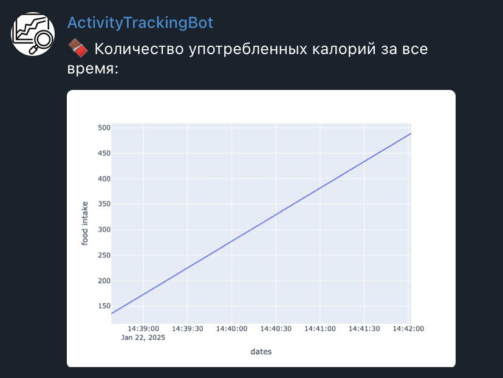
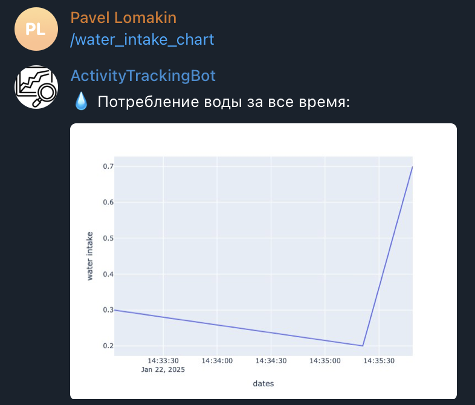

# Health tracking bot

## 🚀 About

Данный проект выполнялся в рамках домашнего задания по курсу "Прикладной питон"
в магистратуре Искусственный Интеллект ВШЭ. Телеграм бот @ActivityAndHealthTrackingBot
умеет довольно глупым образом вычислять норму воды и калорий, сохранять информацию
о количестве употрбленных продуктов, а также выводить графики.

## ⚙️ Functionality

Взаимодействие с ботом осуществляется с помощью следующих команд:

* **/start**

Обычная команда для старта бота. При запуске в БД сохраняется информация
об ID пользователя, а также его имя и фамилия. 
Если бот запускается повторно и пользователь уже был до этого зарегестрирован, 
то бот просто приветствует его.

* **/set_profile**

С помощью данной команды можно актуализировать информацию о пользователе. Есть возможность
добавить следующие данные: вес, рост, возраст, количество активности в минутах, текущий город.
Эти данные используются для вычисления нормы воды и количества калорий.

* **/log_water**

Данная команда позволяет сохранить информацию о том, сколько литров воды выпил человек.
Рядом с командой указывается соответствующее количество литров.

* **/log_food**

При помощи этой команды можно сохранять информацию о количестве употребленных калорий.
Рядом с командой указываются два параметра: название продукта и количество грамм.
Для поиска калорийности используется специальное API (к слову, не очень удачное, поэтому для того, чтобы
данная команда работала хоть немного корректно, лучше вводить простые продукты. Например, банан или
шоколад). 
Также нужно отметить, что из-за используемого API выполение данной команды
может занять некоторое время. Если введенный продукт не будет найдет или произойдет какая-то ошибка,
то будет соответствующее уведомление об этом.

* **/log_workout**

Команда для сохранения информации о прошедшей тренировке. Есть возможность сохранить информацию о 5 видах
тренировки: силовая, кардио, функциональная, танцы и йога. Также, пользователь вводит продолжительность
тренировки в минутах. 
После сохранения данных вычисляется количество сожженных калорий по следующей формуле:
duration * workout_duration_factor[workout_type]. workout_duration_factor зависит от типа тренировки. Например,
если это кардио, то он равен 15, если силовая, то 10. 
После ввода данных также отображается рекомендованное количество миллилитров воды, которое стоит выпить после
тренировки. Оно вычисляется по следующей формуле: 200 * workout_duration / 30. То есть. добавляется 200 мл за каждые 30 минут 
тренировки.

* **/check_progress**

С помощью этой команды можно вывести прогресс по воде и калорям в тот же день, когда было
обращение к этой команде. 
Выводится информация и количестве выпитой воды, нормы воды, количество потребленных и сожженных калорий,
а также их норма. Норма для воды вычисляется по формуле: weight * 30 + 500 * activity_level / 30 + 500 * [temperature > 25],
а норма для калорий с помощью этой: 10 * weight + 6.5 * height - 5 * age.

* **/food_intake_chart**

Данная команда позволяет вывести график с информацией о съеденных продуктах
за все время. Ось Y это количество грамм съеденных в дату, которая нахожится
по оси X.

* **/water_intake_chart**

Тоже самое, что и для команды /food_intake_chart, только выводится информация
о количестве выпитой воды.

